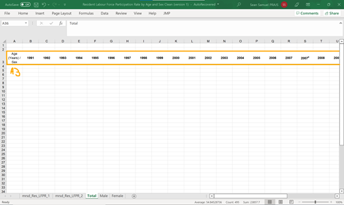
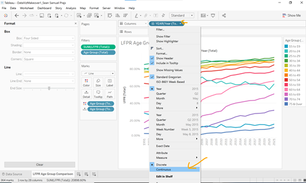

# 1 Critique
Prof. Kam has given us the following graph to work on:


## 1.1 Clarity

First we analyse the clarity of the graph and the elements (or lack thereof) that
impede clarity.

1. Title
  + Missing Information: The title simply gives the dependent variable. However,
  it does not specify a location (Singapore?, Global?, etc.) Moreover, mentions
  neither the time frame nor by what groups the graph is broken down.
  + No Subtitle: There is no subtitle to clear up doubts or to point to trends.
2. Axes
  + Double Labeling: Not only has the graph been broken down into different
  sections as determined by age group, but the same criteria (age group) has been
  used for the legend and the colouring. This is unneccessary and confusing to
  the eye.
  + Y Axis Title: "Lfpr" is not a common abbreviation and therefore needs to be
  spelled out as "Labour Force Participation Rate" for clarity.
  + X Axis Ticks: The tick for each section of the graph shows "2015". However,
  the graph seems to attempt at showing a time series. Therefore, these ticks
  are misleading to the reader.
3. Trends
  + Discernable Trends: Having the time series graph for each age group in a
  separate section makes it hard to compare the trends with each other. This
  type of graph would be better to compare absolute values than a rate.
  + Overlapping Groups: There are two pairs of overlapping groups. "70 & Over"
  and "70 to 74" and "70 & Over" and "75 & Over." These group pairs most likely
  share data and are therefore not comparable and should not be displayed against
  each other in a visualisation.
  + Missing Annotations: There are no annotations explaining any trend that can
  be seen in the graph.

## 1.2 Aestethics

1. Sorting
  + Age Group: The Age Groups are not sorted in order of age. Especially when it
  comes to the Legend, this sorting choice is unpleasant to the eye.
2. Ink
  + Ticks: The ticks are faded. However, for better aesthetics they should have
  full fill colour like the axes labels.
3. Axes
  + X Axis Ticks: There seems to be a separate x axis for each age group section
  in the graph. Each section is labelled "Year." This kind of repition is unnecessary.

# 2 Improvements

## 2.1 A first sketch
Below you can see the plan for a new and improved visualisation:


## 2.2 Clarity

1. Title
  + Missing Information: The title will display a key insight from the graph to
  allow the user to better understand the purpose of the graph
  + No Subtitle: The subtitle will mention location, time period, and that
  the data is split by age group
2. Axes
  + Double Labeling: Age Group is only used as colouring
  + Y Axis Title: "Labour Force Participation Rate" will be spelled out and the
  y axis ticks will show percentage signs.
  + X Axis Ticks: The x axis ticks will refelct the full range of data.
3. Trends
  + Discernable Trends: Sections will be removed for easier comparison.
  + Overlapping Groups: Group "70 & Over" will be removed.
  + Missing Annotations: Annotations will be added.

## 2.3 Aestethics

1. Sorting
  + Age Group: Sorting will happen by age from young to old.
2. Ink
  + Ticks: Ticks will enjoy full colour.
3. Axes
  + X Axis Ticks: One x axis for all age groups is implemented.

# 3 Visualisation
The following is the final visualisation:


The link to Tableau Public is [here](https://public.tableau.com/app/profile/sean.prajs/viz/DataVizMakeover1_SeanSamuelPrajs/LFPRAgeGroupComparison?publish=yes).

# 4 Step-By-Step Guide to Visualisation

Step | Change | Screenshot
---- | ------ | ----------
1.| Duplicate Excel File and rename to: “Resident Labour Force Participation Rate by Age and Sex Clean.xls” | 
2.|Create 3 extra tabs in the Excel File named “Total,” “Male,” and “Female.”| 
3.|Copy and paste and the header row from “mrsd_Res_LFPR_2” into each one of  the new sheet with the first cell always being A3|  
4.|Copy and paste the respective table to each of the 3 new sheets. Important: paste values only. Save and close the file.|  
5.|Change the “Males” and “Females” values in cell A4 of the “Male” and “Female worksheets into “Total”| 
6.|Repeat Steps 2-5 using the data from “mrsd_Res_LFPR_1”. This time call the three new sheets “Total Summary,” “Male Summary,” and “Female Summary”|  
7.|Open a new Tableau document and import “Resident Labour Force Participation Rate by Age and Sex Clean.xls”| 
8.|Drag “Total,” “Male,”  “Female,” “Total Summary,” “Male Summary,” and “Female Summary” in as a data source. The relation between tables should be: Age (Years) / Sex = Age (Years) / Sex.| 
9.|Hide column “2007A” (“2007a”) in each table.|  
10.|For each of the tables select each year column. This means every column from 1991-2021.Right click on any column while holding the selection and click “Pivot.”| 
11.|Rename the “Pivot Field Names” column into “Year (Table Name).”| 
12.|Change the Year column data type from “String” to “Date”|  
13.|Change the “Pivot Field Values” column data type from “String” to “Number (decimal)”| 	 
14.|Create a calculated column by dividing the values in the “Pivot Field Values” column by 100. Name the new column “LFPR (Table Name)” for each table. Hide the “Pivot Field Values” column.| 	 
15.|In each of the relations between the tables, equate the year columns.| 	 
16.|For each table, rename “Age (Years) / Sex” to “Age Group (Table Name).”| 	 
17.|Go to “Sheet 1” and rename it to “Age Group LFPR Comparison”| 	 
18.|In each of the tables on the left hand pane select the respective LFPR column and select “Default Properties”  “Number Format.”	|  
19.|Change the number format to “Percentage” and click “Ok.” Keep 2 decimal places.| 	 
20.|Collapse all tables except for “Total”| 	 
21.|Add the Year component of “Year” to the column pane and “LFPR” to the row pane. Add “Age Group” to the Detail and Color panes.	| 	 
22.|From the above step we can see that the data for three years is missing. These years are 1995, 2000, and 2005. However, given that we are interested in the labour force participation rate over time rather than in specific years, we remove these null values from the graph. Click the box labelled “45 nulls” at the bottom right of the page.	| 	
23.|Next, click filter data. This will exclude the three years without data from the graph.	| 	 
24.|Given that we have excluded certain values, we have to put in a warning such that any viewer of the graph will now this. Click on the little arrow at the top right of the title box and click “Edit Title”| 		 
25.|Press enter and put in a place holder for the subtitle. Press enter two more times and enter the warning message as shown in the picture. The font should be 8, red, and boldened. | 		 
26.|Exclude the categories “70 & Over” and “Total” from the graph.| 		 
27.|Click the small arrow in the Age Group Legend pane. Click “Edit Colors.”	| 	 
28.|Click on the drop-down menu under “Select Color Palette” and choose “Hue Circle.” | 		 
29.|“Assign Palette” and click “Ok.”| 		 
30.|Hover over the y axis , right click, and select “Edit Axis.”| 		 
31.|Go to the “Tick Marks” tab and for Major Tick Marks set “Fixed.” Also set Tick Origin = 0 and Tick Interval = 0.2.| 		 
32.|To make the graph static, we need to turn off the tooltip. Go to Worksheet --> Tooltip| 		 
33.|Uncheck “Show tooltips” and click “Ok.”| 		 
34.|Hover over the blue Year ribbon in the column pane. Click on the little arrow that appears on the right-hand side. Select continuous.	 | 	
35.|We can see that the ticks on the x axis automatically change. However, there is a problem, the three missing years are included as ticks. Therefore, a change in tick values is needed. Right click the x axis and select “Edit Axis.”| 		 
36.|Go to the “Tick Marks” tab and for Major Tick Marks set “Fixed.” Also set Tick Origin = 1 and Tick Interval = 5. Select “No” for Minor Tick Marks.	 | 	
37.|Go back to “General” and change the axis title to “Year”	| 	 
38.|Repeat the previous step for the y axis, renaming it “Labour Force Participation Rate.”| 		 
39.|Right click the x axis and select “Add Reference Line.”| 		 
40.|Add a reference line with following settings: <br /> Scope: <br /> • Per Pane <br /> Line: <br /> • Value: 2020 - Constant <br /> • Label: Custom - Covid 19 Pandemic <br /> • Tooltip: None <br /> Formatting: <br /> • Line: - - (middle selection)| 		
41.|Add a reference line with following settings: <br /> Scope: <br /> • Per Pane <br /> Line: <br /> • Value: 1999 - Constant <br /> • Label: Custom - SG Retirement increased to 62 <br /> • Tooltip: None <br /> Formatting: <br /> • Line: - - (middle selection) <br /> <br /> Information Source for this can be found [here](https://www.todayonline.com/singapore/govt-raise-retirement-age-65-and-re-employment-age-70-2030-cpf-contribution-rates-older).| 
42.|Add a third reference line with following settings: <br /> Scope: <br /> • Per Pane <br /> Line: <br /> • Value: 2008 - Constant <br /> • Label: Custom - Subprime Mortgage Crisis <br /> • Tooltip: None <br /> Formatting: <br /> • Line: - - (middle selection)| 
43.|Add a third reference line with following settings: <br /> Scope: <br /> • Per Pane <br /> Line: <br /> • Value: 1997 - Constant <br /> • Label: Custom - Asian Financial Crisis <br /> • Tooltip: None <br /> Formatting: <br /> • Line: - - (middle selection)| 
44.|Right click the Asian Financial Crisis reference line and select “Format...”	|  
45.|Change the alignment to left and up. Repeat this for the other three reference lines with the following allignments:<br /> SG Retirement: right and up <br /> Subprime Mortgage Crisis: left and down <br /> Covid 19 Pandemic: left and down| 	 
46.|Last, change the title to following text: <br /> (font 15) <br /> Singapore's Labour Participation is increasing in almost all age groups despite global crises. <br /> (font 10) <br /> Labour Force Participation Rate in Singapore across age groups between 1991 and 2021| 


# 5 Key Insights

Finally, what can we learn from the graph?

1. Crises do not seem to affect Singapore's LFPR too much. Neither the Asian Financial 
Crisis in 1997 nor the Subprime Mortgage Crisis in 2008 have impacted the LFPR.
All age groups just continue towards the trend they were following before the crisis.
  + The only exception to this is the 2020 Covid 19 Pandemic. Here, the age group
  "20 to 24" has had a steeper drop (approx. 60% -> 55%) in 2020. However, this
  effect seems to not have been longlasting as the numbers recovered to over 60%
  for this age group the year after.
  
2. Singapore's LFPR is increasing for most age groups. Other than the two youngest
age groups, not a single one has had a long lasting downwards trend in the past 30
years. This is a positive development for Singapore's workforce as a trend like this
usually entails lower unemployment and poverty within the population.

3. The age groups in the middle have the highest LFPR. Since 2008 the age groups
between 25 and 59 have consistently had higher LFPR than the groups younger and
older than them. Specifically, this gap has grown to more than 10% at its narrowest
point in 2021.

4. Singapore's raise in retirement age has an affect on the "60 to 64" age group.
However, there was a delay in policy effect. The implementation happened in 1999,
while the first steep rise in this age group only happened around 2003. These
policies usually are expected to have a delay.

5. People age 20 to 24 have a significantly lower LFPR than they had 30 years ago.
This might have to do with an increase in Singapore's wealth which gave more young
people the opportunity to attend tertiary education instead of having to work
immediately.

6. The gap between the top middle aged (25-59) age group and the bottom one has
closed to a large extent. While in 1991 this gap seems to have been around 40%,
it is only approximately 15% in 2021.

```{r setup, include=FALSE}
knitr::opts_chunk$set(echo = FALSE)
```


# Distill Disclaimer

Distill is a publication format for scientific and technical writing, native to the web. 

Learn more about using Distill for R Markdown at <https://rstudio.github.io/distill>.


