# 1 Critique
Prof. Kam has given us the following graph to work on:

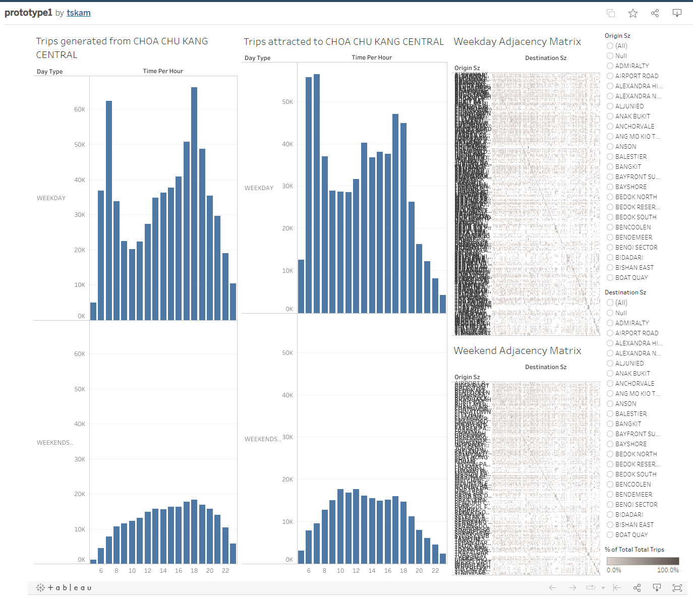


## 1.1 Clarity

First, let us look at the elements of the graph that are detrimental to clarity.

1. Titles and Subtitles
 + i) Missing Title: The graph is given to us without any context as to what the purpose of the visualisation is. This makes it unclear what to look for in the graph
 + ii) Missing Subtitle: There is no support element to the graph that explains a key insight.
 
2. Axes
 + i) Not synced x-axes: Between the two graphs on the left of the visualisation the hours per day shown on the graphs' x-axes have different tick values. This makes a comparison across the two graphs difficult.
 + ii) Labels: The labels on the y-axis for both of the lefthand-side graphs denote the filtering of the graphs by day type. However, as they are placed right next to the ticks of the y-axis it makes it unclear what the numbers on the y-axes denote.
 
3. Variable names:
 + i) Some of the names and labels of the axes such as "Origin Sz" are unclear. Without further information it is not possible to discern what "Sz" stands for.
 
4. Colouring:
 + i) Adjacency Matrices: While the matrices are coloured according to the percentage of trips of the total table, the difference in colour across the table is not clear as there are too many values.
 
5. Positioning:
 + i) Filters: the filters only change information on the lefthand-side graphs. Therefore it is confusing that they aren placed next to the adjacency matrices instead of the bar charts.
 
## 1.2 Aesthetics

Next, let us discern the issues with the aesthetics of the visualisation:

1. Too large data:
 + i) Adjacency Matrix: the adjacency matrix is too populated with data and therefore not aesthetic to the eyes.
 
2. Positioning:
 + i) Graphs: Graphs are positioned all next to each other. This gives a feeling of cluttering that makes it unaesthetic to look at the visualisation.
 + ii) Adjacency Matrices: Placed above each other and are therefore hard to compare and not pleasing to the eye.

3. Axes:
 + i) Bar Chart y-axis: The two y-axes on the bar charts are separate for weekends and weekdays, since the data is placed on two different axes. This makes it hard to compare the two and, given the small amount of data for weekend trips, there is no possibility to discern useful insights just from graphs showing weekend data.
 
## 1.3 Interactivity

Lastly, in the critique section, we will be examining the flaws in the interactive features of the visualisation.

1. Filters
 + i) Abundance of Options: There are too many options in the filters and it is hard to find specific subzones based on the list.
 + ii) Position: Filters are not positioned next to the filtered data.

2. Adjacency Matrices:
 + i) Abundance of Data: Too many data points visualised at once make it hard to find and hover over a specific origin / destination pair in the matrices.

3. Bar Charts:
 + i) Tooltips: Data is not properly labeled insight the tooltips which makes reading data out of them confusing and unintuitive.

# 2 Improvements

## 2.1 A first sketch
Below you can see the plan for a new and improved visualisation:
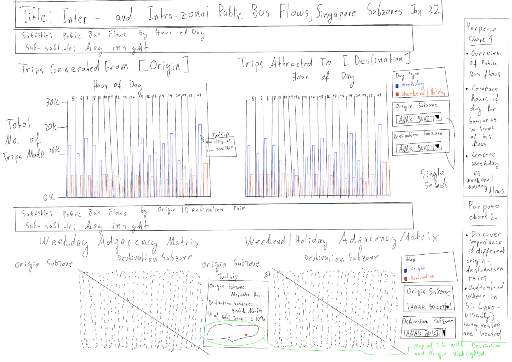

So how does this improve the abovementioned pain points? Let us find out!
## 2.2 Clarity

1. Titles and Subtitles
 + i) Missing Title: Title to show the objective of the graph
 + ii) Missing Subtitle: Subtitle to provide context over the different types of graphs.
 
2. Axes
 + i) Not synced x-axes: Sync x-axes
 + ii) Labels: Labels around the y-axes to be only information on the values of the y-axes. The weekend/weekday split will be shown in a colour legend.
 
3. Variable names:
 + i) Instead of using abbreviations like "Sz" the full names will be used such as "Subzone"
 
4. Colouring:
 + i) Adjacency Matrices: Colouring will be removed to safeguard the breadth of the data.
 
5. Positioning:
 + i) Filters: Filters will be positioned next to the graphs they filter.
 
## 2.3 Aesthetics

1. Too large data:
 + i) Adjacency Matrix: Include multi-select dropdown menu filters for the adjacency matrices such that user can limit the visualisation to subzones of their interest.
 
2. Positioning:
 + i) Graphs: Only position related graphs next to each other. Have to seperate sections on the dashboard for the bar graphs (on top) and the adjacency matrices (below).
 + ii) Adjacency Matrices: Place adjacency matrices next to each other for easier comparison.

3. Axes:
 + i) Bar Chart y-axis: Place weekend and weekday bars on the same set of axes with a grouped bar chart and discern between them using colours. This will make for an easier comparison between the two.
 
## 2.4 Interactivity

Lastly, how will we remedy some of the interactivity flaws?

1. Filters
 + i) Abundance of Options: Change the filters from lists to dropdown menus.
 + ii) Position: Filters will be placed next to the data they filter.

2. Adjacency Matrices:
 + i) Abundance of Data:
   + a. Increase size of adjacency matrices for easier discernment. 
   + b. Dropdown menu filters to allow user to decrease adjacency matrices only to subzones of interest.

3. Bar Charts:
 + i) Tooltips: Label data properly for facilitated understanding of the graph.
 
# 3 Visualisation
Under here you can see a snapshot of the final product of this Data Viz Makeover. The full interactive version can be found on Tableau Public [here](https://public.tableau.com/app/profile/sean.prajs/viz/DataVizMakeover2_SeanSamuelPrajs/Dashboard1?publish=yes).

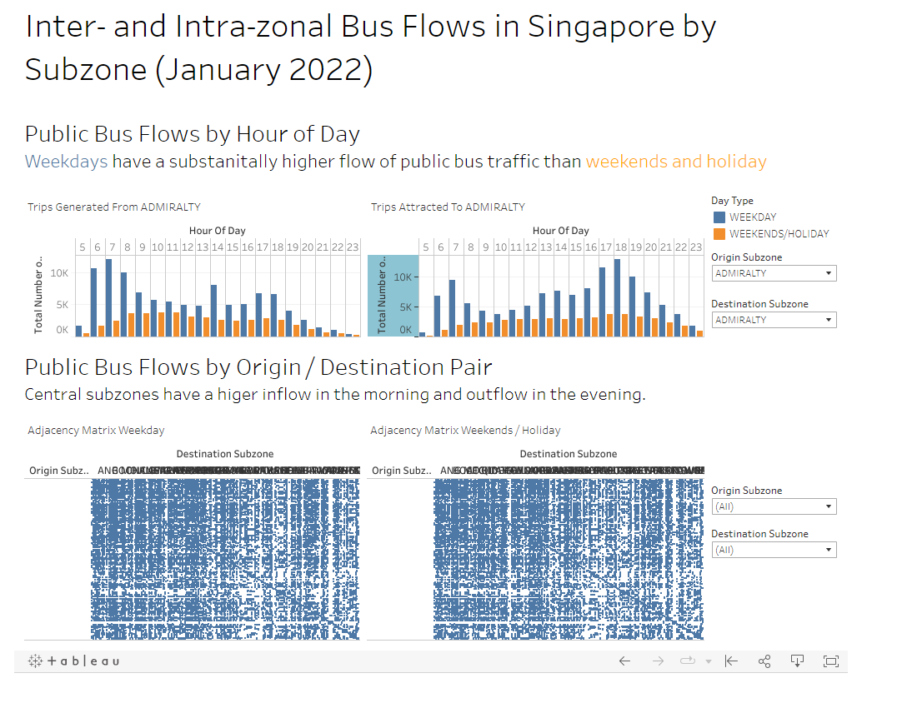

# 4 Step-By-Step Guide to Visualisation

Step | Change | Screenshot
---- | ------ | ----------
1.| Open Tableau Prep Builder | 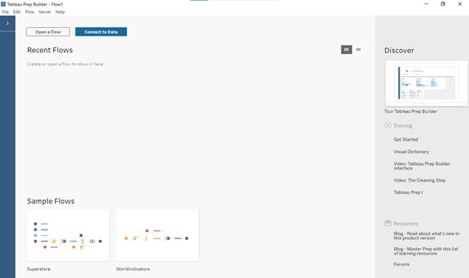
2.|Import both, the shape file (green) and the data file (orange) into Tableau Prep Builder and drag them into the main pane.| 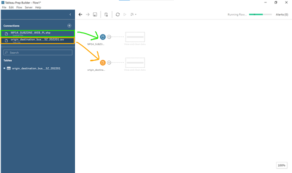
3.|Click “view and clean data” (1.) on the data file flow. Change to list view (2.) and find the variable “TIME_PER_HOUR” (3.) and rename it to “HOUR_OF_DAY” (4.).| 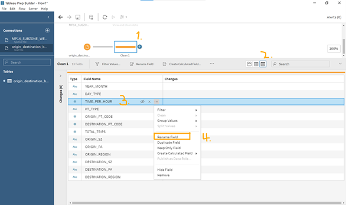 
4.|Repeat the previous step for variables “ORIGIN_SZ” and “DESTINATION_SZ”, renaming them “ORIGIN_SUBZONE” and “DESTINATION_SUBZONE” respectively.| 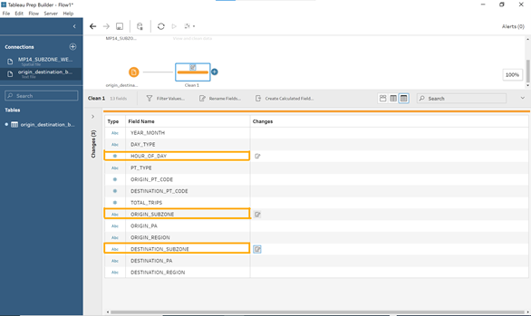 
5.|Navigate to the “YEAR_MONTH” variable (1.). Change its data type from “String” to “Date” (2.).| 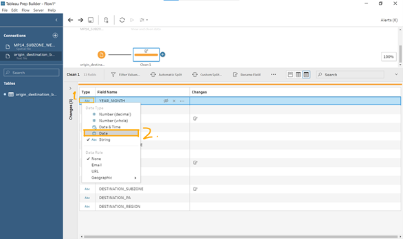
6.|Next, move to the profile pane (1.) and find the variable “ORIGIN_SUBZONE” and right click on the “null” value category (2.). Exclude the null value from the variable (3.).| 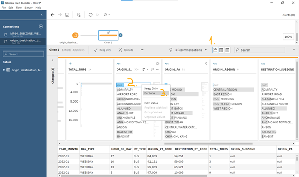 
7.|Repeat the last step with variable “DESTINATION_SUBZONE”.| 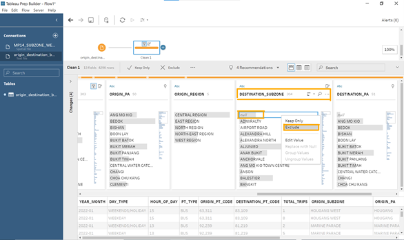
8.|Go back to the flow menu. Right click shape file data and click on “Rename”. Rename the file to “Shapes_Origin”. | 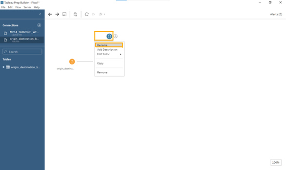
9.|Drag “Shapes_Origin” towards the cleaned data file and drop it on the appearing “Join” pane.| 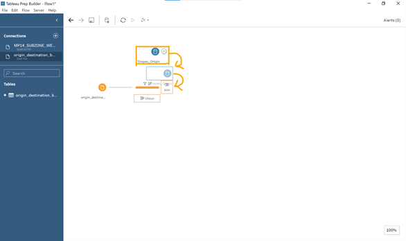 
10.|Change the join type to “full”. <br /><br /> (Note: the purpose of this is to ensure that both, the origin and destination subzone columns, will be able to interact with the shapefile.) | 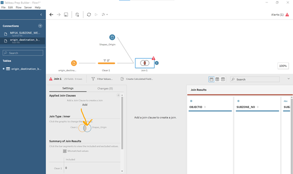
11.|Click “Add” in the “Applied Join Clauses” section to add a join.| 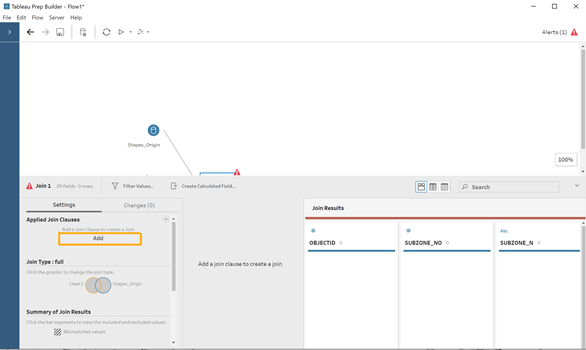
12.|Join the “Clean 1” and “Shapes_Origin” tables on their “ORIGIN_SUBZONE” and “SUBZONE_N” variables respectively. <br /><br /> Add a join clause between “DESTINATION_SUBZONE” and “SUBZONE_N”.| 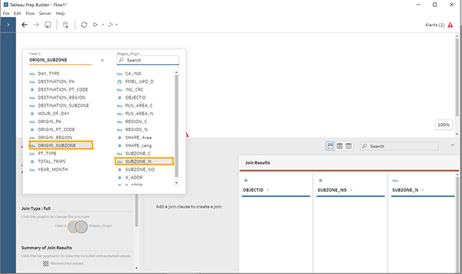 
13.|The final join should look as follows. Make sure the settings and numbers match what is shown inside the orange boxes in the image.| 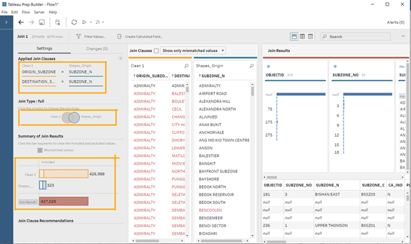	 
14.|Add an output node to the flow.| 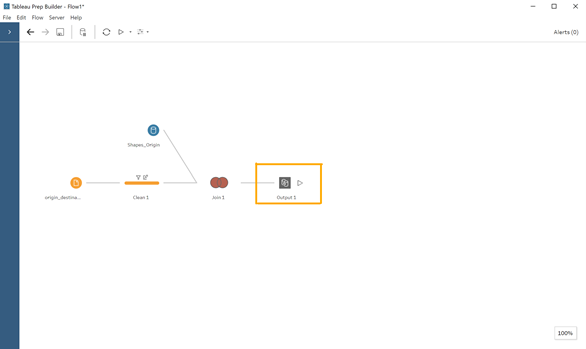	 
15.|Locate an appropriate location on your device to save the output file (1.). Rename the file to “Bus Flows and Shapes” or another name you deem appropriate (2.). Last, press “Run Flow” (3.).| 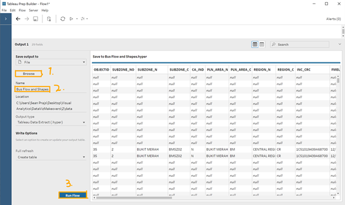	 
16.|Open Tableau Desktop and import “Bus Flows and Shapes”| 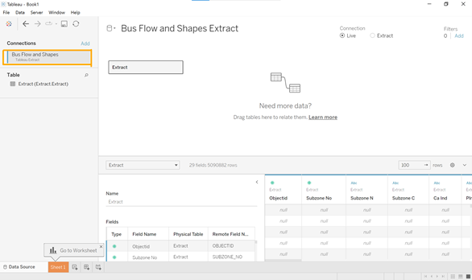	 
17.|Got to “Sheet 1” (1.) and rename it to “Origin Subzone Trips by Hour of Day” (2.).| 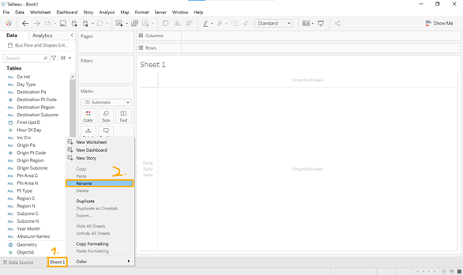	 
18.|Go to “Hour of Day” and right click it (1.) and convert it from a continuous to a discrete variable (2.).| 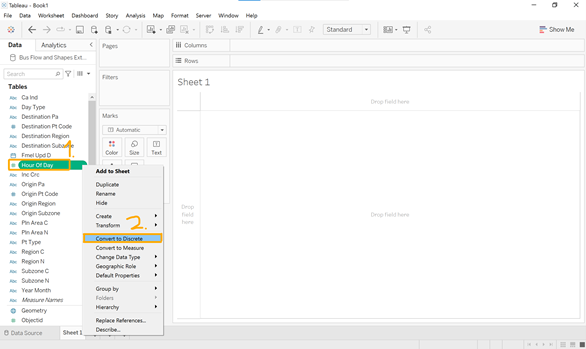 
19.|Drag “Hour of Day” into the column pane and “Total Trips” into the row pane.| 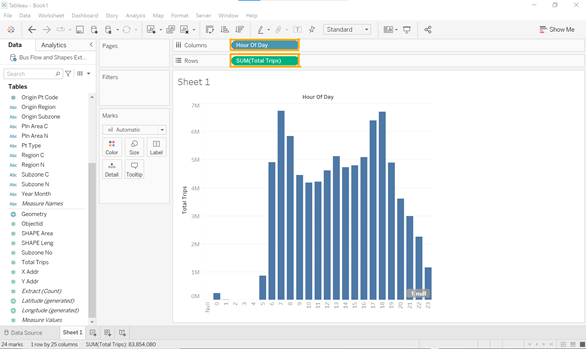	 
20.|Drag “Hour of Day” into the filters pane and filter out all hours outside the 5 to 23 range. <br /><br /> Untick the boxes for “Null”, “0”, “1”, “2”, “3”, and “4”.| 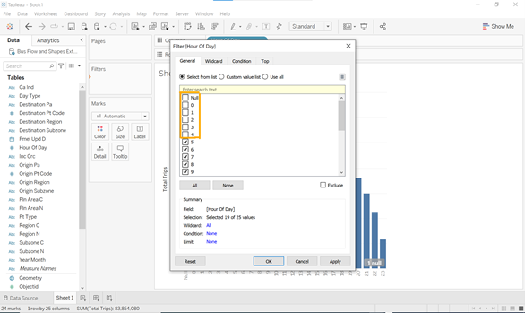	 
21.|Next, drag “Origin Subzone” into the filter pane and only select “ADMIRALTY”.| 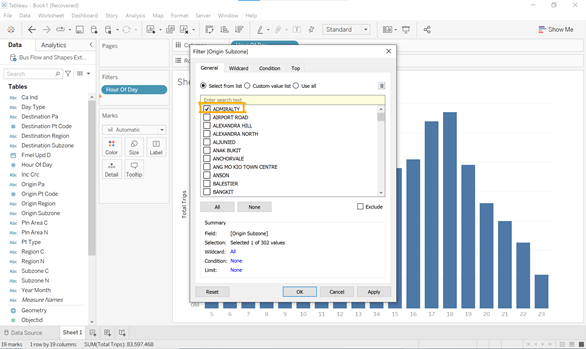	 
22.|Show the Filter for “Origin Subzone”.| 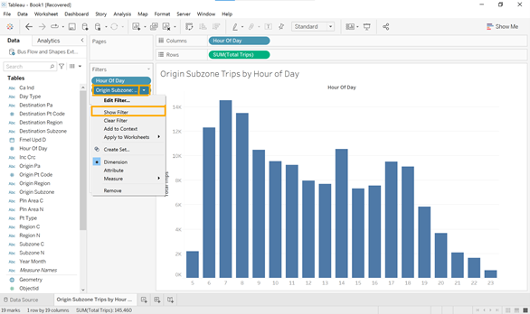	
23.|Change the “Origin Subzone” filter to a single value drop down list.| 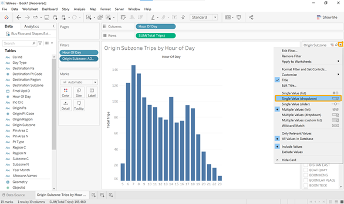	 
24.|Drag “Day Type” into both, the column pane and the colour pane (orange boxes). <br /><br /> Change the view to from “Standard” to “Entire View” (green box).| 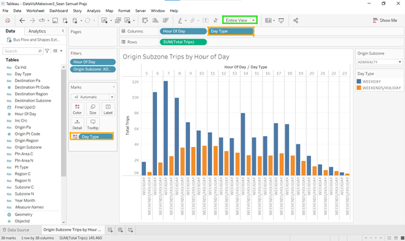		 
25.|Right click anywhere on the x-axis and and deselect “Show Header”.| 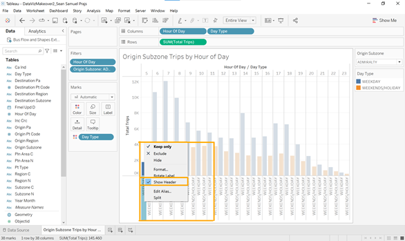		 
26.|Right click anywhere on the y-axis and click “Edit Axis”| 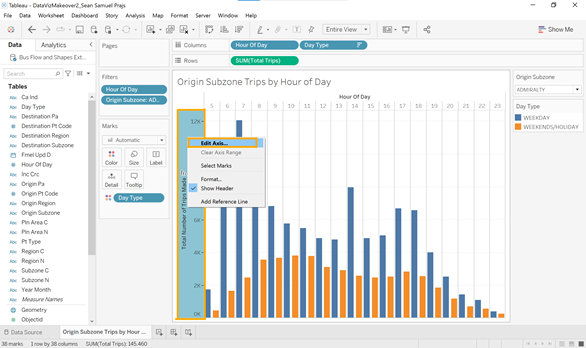		 
27.|Change the axis title to “Total Number of Trips Made”.| 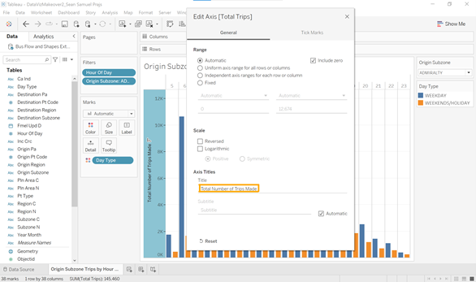	 
28.|Click on “Tooltip” and delete the “Day Type” line.| 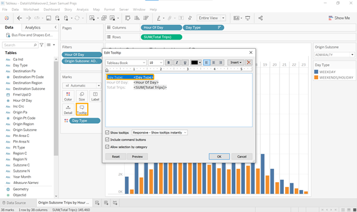		 
29.|Right click on the title and select “Edit Title”.| 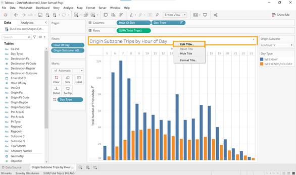		 
30.|Change the title to “Trips Generated From <Origin Subzone>”.| 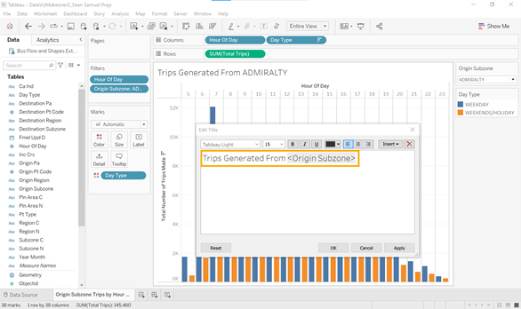		 
31.|Right click the sheet tab and duplicate the current sheet.| 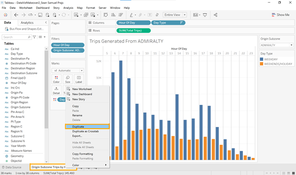		 
32.|Rename the duplicated sheet tab to “Destination Subzone Trips by Hour of Day”.| 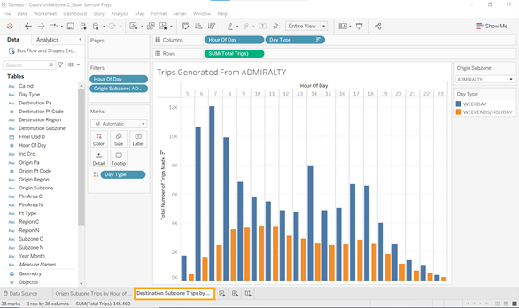		 
33.|Drag “Destination Subzone” to replace “Origin Subzone” in the filters pane.| 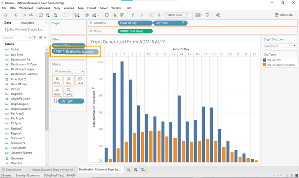		 
34.|Select only “ADMIRALTY” and click “Ok”.| 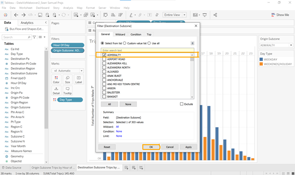	
35.|Show the filter and change it to a single select dropdown menu as outlined in steps numbers 22 and 23.| 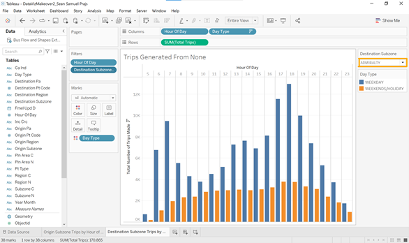		 
36.|Change the title of the graph to “Trips Attracted To <Destination Subzone>” as shown in steps numbers 29 and 30.| 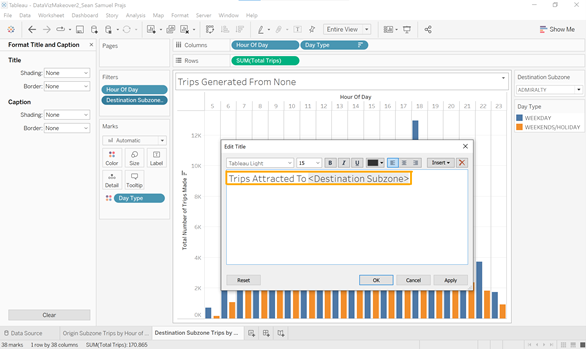	
37.|Create a new sheet.| 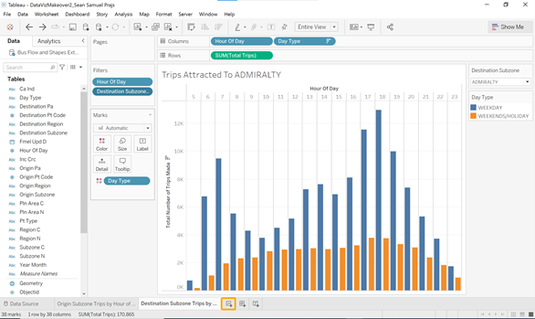	 
38.|Rename the sheet to “Adjacency Matrix Weekday”| 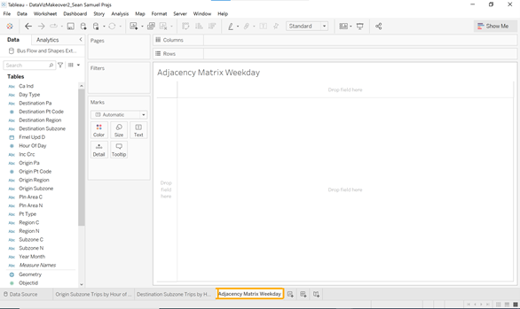		 
39.|Drag “Origin Subzone” and “Destination Subzone” into the columns and rows panes respectively. <br /><br /> Drop the “Total Trips” variable onto the text pane. <br /><br /> Change the view to “Entire View”.| 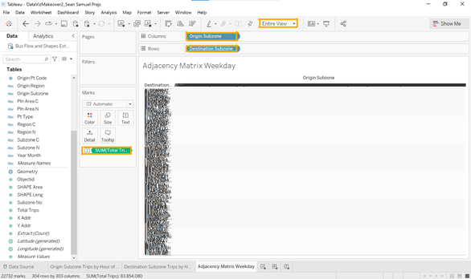		 
40.|Next, select the “Show Me” pane and change the graph type to heatmap. <br /><br /> Make sure to check that the graph shows in “Entire View”| 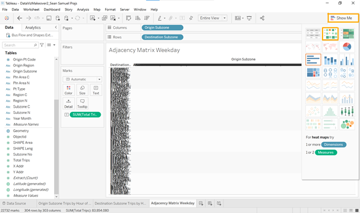		
41.|Drag “Day Type” into the filters pane and only select “WEEKDAY”. This time we will not be showing the filter in the righthand-side menu.| 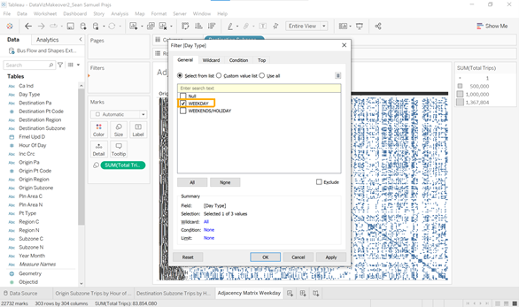
42.|Add filters for “Origin Subzone” and “Destination Subzone”. Set them as dropdown menu multiselect. <br /><br /> Furthermore, right click the “SUM(Total Trips)” and hide it.| 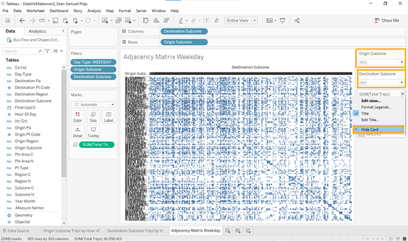
43.|Right click the “SUM(Total Trips)” field in the markers pane and select “Quick Table Calculations” > “Percent of Total”.| 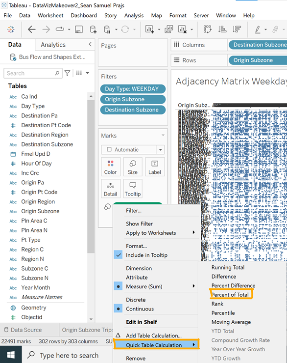
44.|Duplicate the current sheet as shown in step number 31. <br /><br /> Rename the sheet to “Adjacency Matrix Weekends / Holiday”. <br /><br /> The title should change automatically.| 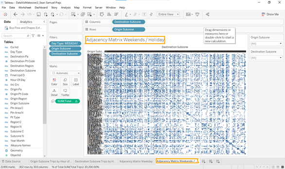 
45.|Switch the “Day Type” filter to “WEEKENDS/HOLIDAY”.| 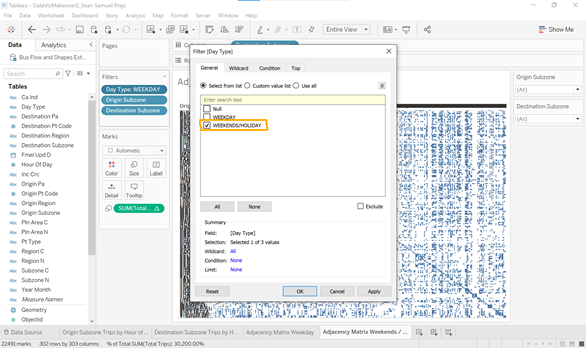
46.|Open a new Dashboard| 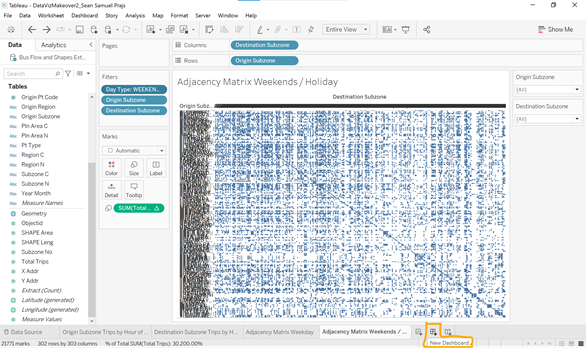
47.|Drag in the two “By Hour of Day” Sheets next to each other. The “Origin” sheet should be on the left and the “Destination” sheet should be on the right. Make sure the legend is on top, then the origin filter and then the destination filter.| 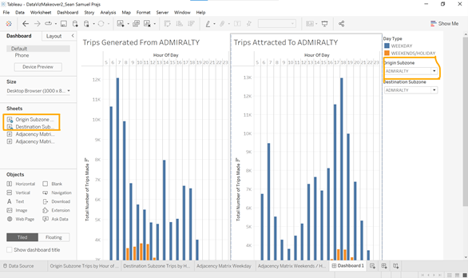
48.|Go to the “Adjacency Matrix Weekday” (1.) sheet and for each of the two filters (2.)  select: “Apply to Worksheets”(3.) > “Selected Worksheets”(4.).| 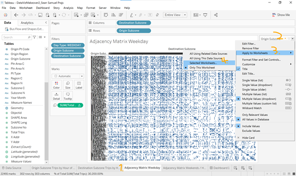
49.|Tick the “Adjacency Matrix Weekends/Holiday” and then click ok to sync the filters over the two sheets.| 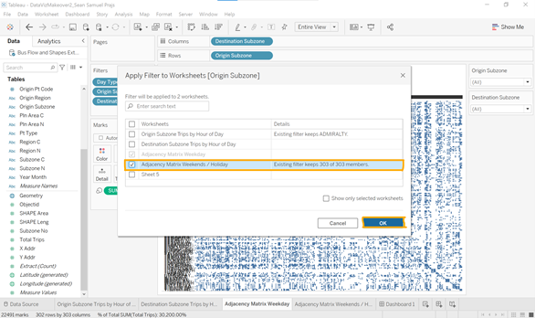
50.|Go back to the Dashboard and arrange the sheets and filters in the following way.| 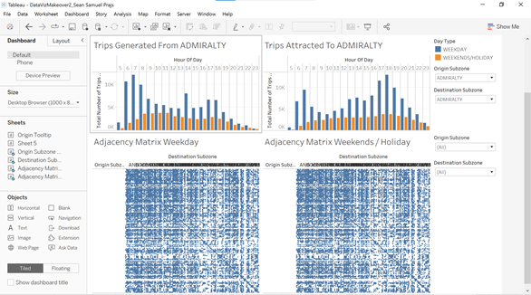
51.| Insert title and subtitles. Title font: 28 Subtitle font: 20 Sub-Subtitle font: 15 Graph Title font: 10| 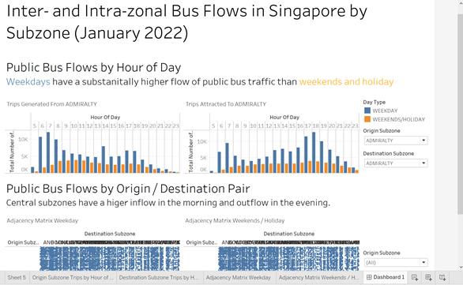


# 5 Key Insights
1. Weekend/Weekday split:
 + At all times of the day the number of bus trips on weekdays is substantially higher than on weekends.
 + A good example would be 18:00 in Admiralty as the destination Subzone. Here there is a more than 9000 public bus trip number difference between weekends and weekdays.

2. Central Timings:
 + More central subzones have a higher amount of bus trips arriving in the morning than in the evening while this trend is opposite for departures where the number is higher in the evening as to the morning.
 + A good example is City Hall Subzone where there are 18 thousand departure trips in the morning hours of 6:00-8:00 versus just under double this number (ca. 34K) betwen 16:00-18:00.
 
3. Total bus trips in Singapore.
 + Overall, Singapore has an enormous number of bus trips every day with alone 7 Million arrivals at subzones in January 2022.


```{r setup, include=FALSE}
knitr::opts_chunk$set(echo = FALSE)
```

Distill is a publication format for scientific and technical writing, native to the web. 

Learn more about using Distill for R Markdown at <https://rstudio.github.io/distill>.


